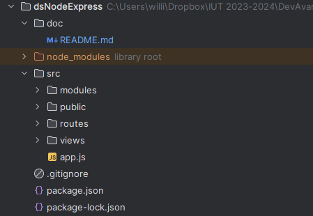
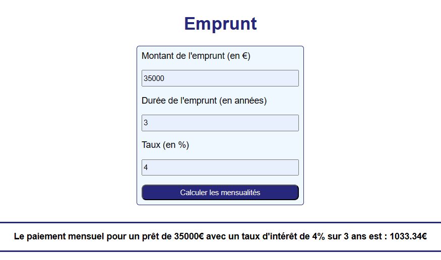

_Pires Nino_ <br>
_Zehren William_ <br>
_Bouedec Nicolas_ <br>


<h1 style="color:#5d79e7; text-align: center"> Rapport DS Node Express </h1>

<h1 style="color:#5d79e7; text-align: center; margin-top: 100px"> Table des matières</h1>

<ol>
    <li> <a href="#introduction"> Introduction  </a> </li>
    <li> <a href="#install"> Installation </a> </li>
    <li> <a href="#archi"> Présentation de l'architecture </a> </li>
    <ol>
        <li> <a href="#arborescence"> Présentation de l'arborescence </a> </li>
        <li> <a href="#pages"> Présentation des pages </a> </li>
    </ol>
    <li> <a href="#code"> Présentation des morceaux de code importants  </a>  </li>
    <ol>
        <li> <a href="#morceaucode1"> Morceau de code 1 : Fonction calculEmprunt </a> </li>
        <li> <a href="#morceaucode2"> Morceau de code 2 : Récupération des valeurs saisies par l'utilisateur, calcul des mensualités et stockage  </a> </li>
    </ol>
</ol>

<h2 style="color:#5d79e7; page-break-before: always" id="introduction"> Introduction </h2>

L'objectif de ce devoir est d'appliquer les connaissances et les savoirs acquis durant le cours de Développement Avancé.

Il nous est demandé de réaliser une application web utilisant NodeJS et ExpressJS permettant à un utilisateur de se connecter au site via un identifiant, puis de calculer les mensualités d'un potentiel emprunt et enfin de consulter ses derniers calculs dans un historique. 

<h2 style="color:#5d79e7;" id="install"> Installation </h2>

Pour pouvoir faire fonctionner le projet, il faut en premier lieu avoir node sur son ordinateur.

Lien de téléchargement : https://nodejs.org/en/download

Choisissez alors la version qui convient à votre appareil. 

<br>

Il existe ensuite deux cas de figure pour l'installation des différents packages permettant d'utiliser le site : 

- Cas de figure 1 : le fichier package.json est à la racine du projet

Dans le cas où le fichier package.json est à la racine du projet, il suffit d'executer la commande suivante :

```npm install```

- Cas de figure 2 : le fichier package.json n'est pas présent 

Dans le cas où le fichier package.json n'est pas présent, il faut installer tous les packages en utilisant les commandes suivantes :

```npm install ejs```
```npm install express```
```npm install express-session```

<h2 style="color:#5d79e7; page-break-before: always" id="archi"> Présentation de l'architecture </h2>

<h3 style="color:#5d79e7;" id="arborescence"> Présentation de l'arborescence </h3>

Le projet suit donc la structure suivante : 

<div style="text-align:center">

<p> Architecture du projet </p>
</div>

<h3 style="color:#5d79e7;" id="pages"> Présentation des pages </h3>

**La page d'accueil (accueil.ejs) :** est la première page que rencontre l'utilisateur, elle lui permet de se diriger vers les autres pages du site.

**La page de login (login.ejs) :** est la page qui permet à l'utilisateur de se connecter, un utilisateur ne peut se connecter qu'en entrant les logins et mot de passes suivants : user user.

**La page de calcul des mensualités (emprunt.ejs) :** est une page uniquement accessible à l'utilisateur connecté, elle lui permet de calculer ses mensualités via un formulaire.

**La page d'historique (historique.ejs) :** est une page uniquement accessible à l'utilisateur connecté, elle lui permet de visualiser les dernieres mensualités calculées.

**La page 404 (404.ejs) :** est une page accessible lorsqu'un mauvais url est rentré.

l'utilisateur connecté peut également se déconnecter via un bouton de déconnexion.

<h2 style="color:#5d79e7; page-break-before: always" id="code"> Présentation des morceaux de code importants </h2>

<h3 style="color:#5d79e7;" id="morceaucode1"> Morceau de code 1 : Fonction calculEmprunt </h3>


Cette fonction est créée dans le fichier calculEmprunt.js. 

Elle permet de calculer les mensualités d'un emprunt selon le capital (la somme empruntée), le taux d'intêret et la durée de l'emprunt.

Elle prend donc en paramètres le capital, le taux d'interet et la durée de l'emprunt.

Si le taux d'interêt est nul, on calcule directement la mensualité en divisant le capital par le nombre de paiements mensuels (durée*12) puis on retourne cette derniere.

Dans le cas ou le taux d'intêret n'est pas nul, on calcul le taux d'interet mensuel en divisant le taux d'interet par 12 puis par 100.
On calcule ensuite la mensualité avec la formule ```M = P[r(1+r)^n]/[(1+r)^n – 1]```.
On retourne ensuite la valeur de la mensualité.


Après cela, on exporte ce module pour pouvoir le réutiliser dans d'autres fichiers à l'aide d'un ```require('../modules/calculEmprunt')```.

```js
// Définir la fonction de prêt avec des paramètres pour le montant du prêt, le taux d'intérêt et la durée du prêt
function emprunt(capital, taux, duree){

    // Calculer le nombre total de paiements
    const nombreDePayement = duree*12;

    if (taux == 0){
        const mensualite = capital / nombreDePayement;
        return mensualite;
    }

    // Calculer le taux d'intérêt mensuel
    const interetMensuel = taux/12/100;

    // Calculez la mensualité à l'aide de la formule : M = P[r(1+r)^n]/[(1+r)^n – 1]
    const mensualite= (capital * interetMensuel * Math.pow(1 + interetMensuel, nombreDePayement)) /
        (Math.pow(1 + interetMensuel, nombreDePayement) - 1);

    // Return la valeur du paiement mensuel
    return mensualite;
}
```

Exemple de résultat du code :

<div style="text-align:center">

<p> Exemple de résultat de code </p>
</div>


<h3 style="color:#5d79e7;" id="morceaucode2"> Morceau de code 2 : Récupération des valeurs saisies par l'utilisateur, calcul des mensualités et stockage </h3>

Cet extrait de code est tiré du fichier emprunt.js. 

Ce code permet de récuperer les valeurs entrées par l'utilisateur dans le formulaire de calcul de mensualité et de les envoyer à la fonction calculEmprunt traitée précédemment dans ce document.
On effectue ensuite plusieurs tests pour vérifier que les valeurs entrées par l'utilisateur sont conformes et réalistes, auquel cas une erreur apparait en dessous du formulaire de calcul de la mensualité.

Si les valeurs entrées sont correctes on calcule la mensualité puis on initialise un tableau de stockage des valeurs (notre historique). 
On envoie ensuite les différentes valeurs utilisées ainsi que le résultat obtenu dans le tableau de stockage pour pouvoir consulter les anciens résultats obtenus.

On affiche enfin un texte contenant les memes informations en dessous du formulaire pour donner le résultat à l'utilisateur.

```js
router.post('/emprunt', (req, res, next) => {
const resForm = Object.assign({}, req.body);

    const capital = parseFloat(resForm.montant);
    const taux = parseFloat(resForm.taux);
    const duree = parseInt(resForm.duree);

    // Valider les paramètres d'entrée
    if(capital <= 0 || taux < 0 || duree<=0 || isNaN(duree) || isNaN(taux) || isNaN(capital)){

        req.session.lastErrorEmprunt = "Paramètres incorrects, veuillez réessayer";
        //res.render(path.join(__dirname,"..","views","emprunt.ejs"), {pageTitle: "emprunt",isConnected: isConnected, erreur: "Paramètres incorrects, veuillez réessayer", resultatMensuel: ""});
    }
    else{
        // Calculer la mensualité avec la fonction emprunt
        const mensualite = calculEmprunt(capital, taux, duree);

        // Initialiser un tableau dans la session s'il n'existe pas
        req.session.historique = req.session.historique || [];

        // Ajouter les informations du calcul à l'historique
        req.session.historique.push({ capital: capital, taux: taux, duree: duree, mensualite: mensualite});

        req.session.lastResult = "Le paiement mensuel pour un prêt de "+ capital +"€ avec un taux d'intérêt de "+ taux +"% sur "+ duree +" ans est : "+ mensualite.toFixed(2)+"€";


        //res.render(path.join(__dirname,"..","views","emprunt.ejs"), {pageTitle: "emprunt",isConnected: isConnected, erreur: "", resultatMensuel: "Le paiement mensuel pour un prêt de "+ capital +"€ avec un taux d'intérêt de "+ taux +"% sur "+ duree +" ans est : "+ mensualite.toFixed(2)+"€"});
    }
    res.redirect("/emprunt");
});
```


